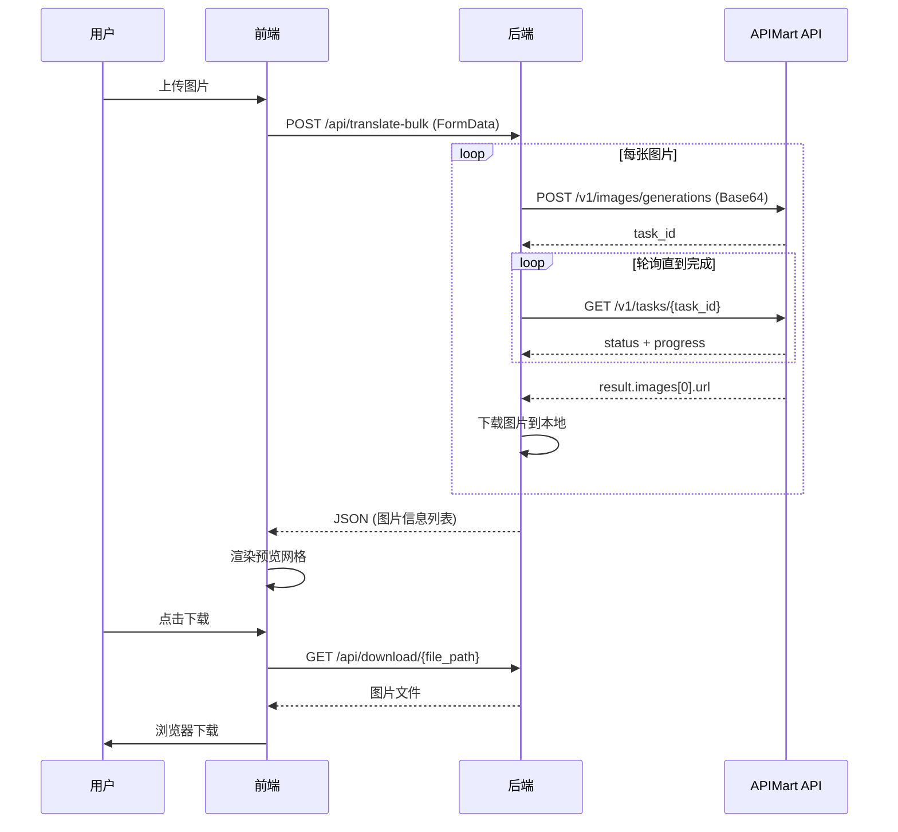

# API 集成总结

## 一、GPT-4o-image API 接入情况

### ✅ 已验证并修正的问题

#### 1. API 端点 URL

- **提交任务**: `POST /v1/images/generations` ✅ 正确
- **查询任务**: `GET /v1/tasks/{task_id}` ✅ 已修正
  - ❌ 原错误: `/v1/images/tasks/{task_id}`
  - ✅ 正确路径: `/v1/tasks/{task_id}`

#### 2. 响应数据结构

根据官方文档，查询任务的响应格式为：

```json
{
  "id": "task_01K8SGYNNNVBQTXNR4MM964S7K",
  "status": "completed",
  "progress": 100,
  "result": {
    "images": [
      {
        "url": "https://cdn.apimart.ai/images/xxx.png"
      }
    ]
  },
  "created": 1709876543,
  "completed": 1709876663,
  "estimated_time": 120,
  "actual_time": 120
}
```

**关键字段**:

- `status`: 任务状态 (pending, processing, completed, failed, cancelled)
- `progress`: 完成百分比 (0-100)
- `result.images`: 图片数组，包含 `url` 字段
- `error`: 失败时的错误信息

#### 3. 代码修正位置

**文件**: `backend/services/translation.py`

```python
# 轮询 URL 修正
url = f"{self.api_endpoint}/v1/tasks/{task_id}"  # ✅ 正确

# 响应数据解析修正
result = response.json()
status = result.get("status", "")  # 顶层字段
progress = result.get("progress", 0)

# 图片 URL 获取修正
result_data = result.get("result", {})
images = result_data.get("images", [])
image_url = images[0].get("url")
```

---

## 二、功能更新

### 新增功能

#### 1. 图片预览功能

- 翻译完成后在网页上展示所有图片
- 网格布局，响应式设计
- 成功/失败状态清晰展示

#### 2. 单独下载

- 每张图片独立下载按钮
- 支持批量下载全部成功的图片
- 不再使用 ZIP 压缩包

#### 3. 结果保留

- 翻译结果保留 30 分钟
- 给用户充足时间预览和下载

### API 变更

#### 旧版本 (ZIP 下载)

```
POST /api/translate-bulk
响应: ZIP 文件流 (StreamingResponse)
```

#### 新版本 (JSON 响应 + 预览)

```
POST /api/translate-bulk
响应: JSON 格式的图片信息列表

GET /api/download/{file_path}
响应: 单个图片文件
```

---

## 三、前后端交互流程



---

## 四、配置说明

### 环境变量 (.env)

```bash
# APIMart API 配置
APIMART_API_KEY=你的真实API密钥
APIMART_API_ENDPOINT=https://api.apimart.ai

# 翻译提示词 (可自定义语言方向)
TRANSLATION_PROMPT=Please translate all text in this image from Chinese to Russian. Keep the original layout and design, only replace the text.

# 并发控制
TRANSLATION_CONCURRENCY=5

# 服务模式: mock (测试) 或 real (生产)
SERVICE_MODE=real
```

### 切换语言方向

修改 `TRANSLATION_PROMPT`:

- **中文 → 英语**:

  ```
  Please translate all text in this image from Chinese to English...
  ```

- **中文 → 日语**:

  ```
  Please translate all text in this image from Chinese to Japanese...
  ```

- **俄语 → 英语**:
  ```
  Please translate all text in this image from Russian to English...
  ```

---

## 五、使用说明

### 本地开发

1. **配置 API Key**:

   ```bash
   cd backend
   nano .env  # 填入你的 APIMART_API_KEY
   ```

2. **启动服务**:

   ```bash
   # 后端
   cd backend && python main.py

   # 前端
   cd frontend && npm run dev
   ```

3. **访问应用**:
   - 前端: http://localhost:5173
   - 后端 API: http://localhost:8000
   - API 文档: http://localhost:8000/docs

### 测试流程

1. 打开 http://localhost:5173
2. 拖拽/选择包含中文文字的商品图片
3. 点击「开始翻译」
4. 等待处理（进度显示在状态栏）
5. 查看预览网格
6. 单独下载或批量下载

---

## 六、注意事项

### 1. 图片格式

- 支持: JPG, PNG, WebP
- 单张大小: ≤10MB
- Base64 编码后上传

### 2. 并发限制

- 官方说明：**无并发限制**
- 本地配置：Semaphore(5) 控制本地并发
- 可根据需要调整 `TRANSLATION_CONCURRENCY`

### 3. 超时设置

- 轮询间隔: 2 秒
- 最大轮询次数: 60 次 (共 2 分钟)
- 超时后任务标记为失败

### 4. 图片链接有效期

- APIMart CDN 图片链接 **24 小时** 有效
- 本地存储保留 **30 分钟**
- 请及时下载

---

## 七、故障排查

### 问题 1: API 调用失败

**检查清单**:

1. API Key 是否正确填入 `.env`
2. 网络是否能访问 `api.apimart.ai`
3. 查看后端日志错误信息

### 问题 2: 任务一直处理中

**可能原因**:

1. API 端点 URL 错误 (已修正)
2. 响应数据解析错误 (已修正)
3. 图片过大导致处理慢

### 问题 3: 图片下载失败

**检查**:

1. 文件路径是否正确
2. 临时文件是否被过早清理
3. 浏览器下载权限

---

## 八、后续优化建议

1. **实时进度反馈**

   - 使用 SSE/WebSocket 推送每张图片的处理进度
   - 显示 `progress` 字段 (0-100%)

2. **错误重试机制**

   - API 调用失败自动重试
   - 指数退避策略

3. **批量任务队列**

   - 支持超大批量 (100+ 张)
   - 后台任务队列处理

4. **图片质量选项**
   - 让用户选择输出尺寸
   - 利用 API 的 `size` 参数 (1:1, 2:3, 3:2)

---

## 九、参考资源

- [APIMart GPT-4o-image 文档](https://docs.apimart.ai/en/api-reference/images/gpt-4o/generation)
- [任务查询 API 文档](https://docs.apimart.ai/en/api-reference/task-management/get-task-status)
- 项目 README: `README.md`
- 进度文档: `PROGRESS.md`
